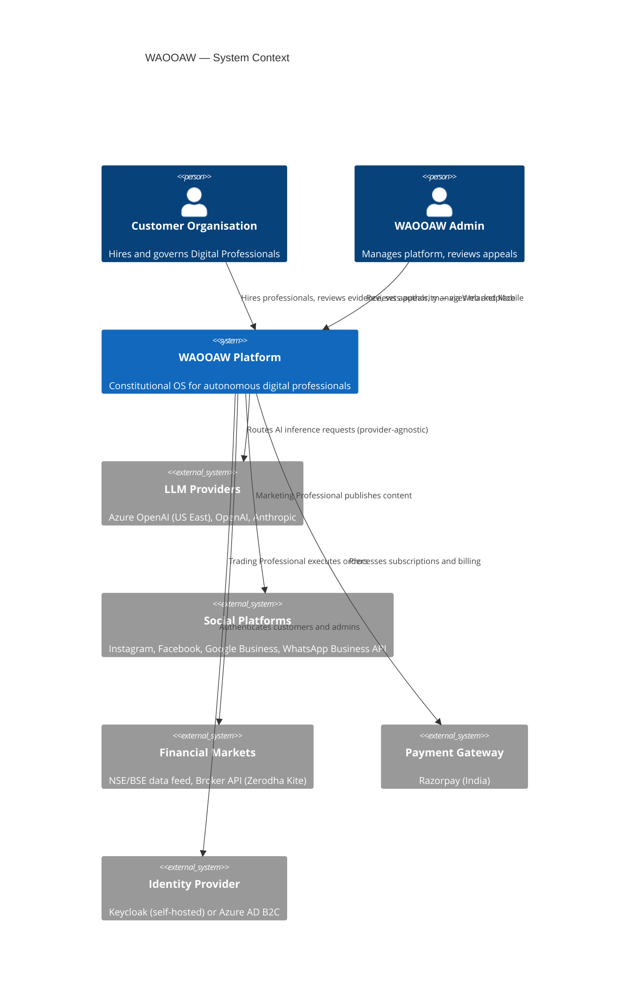

# WAOOAW — Reference Architecture Overview

**Altitude:** 100K — System Context

**Version:** 0.5 (Updated: API gateway removed — Container Apps ingress sufficient at MVI)

**Deployment Target:** Azure India — Central India region (Pune)

**MVI Acceptance Scenarios:** All three from Constitutional Discovery Phase
- Scenario 001: Dental Clinic, Viman Nagar — Asynchronous Marketing Professional
- Scenario 002: Beauty Artist, Mumbai — Asynchronous Marketing Professional (Creative Identity variant)
- Scenario 003: NIFTY Trader, Pune — Synchronous Trading Professional (PAAS mode, <250ms)

---

## The Architectural Forcing Function

Supporting all three scenarios simultaneously produces one hard constraint that governs the entire architecture:

> **The architecture must support both asynchronous approval-gate execution (marketing) and synchronous pre-authorized execution (trading) from a single Constitutional Engine.**

If the architecture handles the trading professional's <250ms latency requirement, the marketing professionals are trivially simpler. Design for trading. Configure for marketing.

---

## System Context (C4 Level 1)



---

## Mobile Strategy

Customers — dentists between patients, traders during lunch, beauty artists between clients — use mobile primarily.

**Phase 1 (MVI): Next.js PWA**
- Full Progressive Web App: responsive, installable on iOS/Android home screen, push notifications
- Emergency Stop button: prominently accessible, mobile-optimized
- Content approval: approve/reject posts on phone
- Evidence review: session summaries readable on small screen
- No app store required. Ships with the web app.

**Phase 2 (Post-MVI): React Native**
- Native iOS and Android
- Shares API contracts with web (no duplication)
- Better camera integration for beauty artist content workflows
- Native trading alerts and vibration for Emergency Stop

**WhatsApp Business integration** (marketing professionals): already in scope as a platform the professional manages. This serves as an additional mobile-native customer touchpoint.

---

## Service Decomposition

GENESIS specifies: **Modular Monolith + Dedicated Autonomous Workforce Runtime**.

This produces **four deployable services** — not 20 microservices, not one monolith:

```
┌──────────────────────────────────────────────────────────┐
│  SERVICE 1: Business Platform                             │
│  .NET 9, Modular Monolith                                 │
│  Modules: Employment | Marketplace | Customer             │
│           Billing | Review & Appeals                      │
│  Pattern: Vertical slice architecture within monolith     │
└──────────────────────────────────────────────────────────┘

┌──────────────────────────────────────────────────────────┐
│  SERVICE 2: Constitutional Engine  ← Core Innovation      │
│  .NET 9, dedicated process                                │
│  Decision Space Registry + Validator                      │
│  Authority License Manager                                │
│  Evidence Recorder (append-only writes)                   │
│  Policy Engine (Constitutional Floors enforcement)        │
│  Three-Ledger Manager                                     │
│  NOTE: Must never be co-hosted with Business Platform     │
└──────────────────────────────────────────────────────────┘

┌──────────────────────────────────────────────────────────┐
│  SERVICE 3: Professional Execution Runtime                │
│  Python, dedicated process                                │
│  Approval-Gate Orchestrator (async path)                  │
│  PAAS Orchestrator (sync, <250ms path)                    │
│  Emergency Stop Handler (WebSocket)                       │
│  External Platform Connectors:                            │
│    Instagram | Facebook | Google Business | WhatsApp      │
│    NSE/BSE data | Zerodha Kite API                        │
└──────────────────────────────────────────────────────────┘

┌──────────────────────────────────────────────────────────┐
│  SERVICE 4: AI Runtime                                    │
│  Python, dedicated process                                │
│  LLM Gateway (provider-agnostic router)                   │
│  Model Router (selects model per profession type)         │
│  Prompt Builder (constitutional context injection)        │
│  Governed Memory Manager                                  │
└──────────────────────────────────────────────────────────┘
```

**Why four, not more:**
- Fewer services = fewer network hops = lower latency = lower cost in dev
- Constitutional Engine must be isolated (Doctrine of Institutional Independence)
- Professional Runtime must be isolated (PAAS latency requirement)
- AI Runtime must be isolated (model routing and provider swapping without rebuilding)
- Business Platform modules can be promoted to independent services when load demands it

---

## Docker-First Local Development

Every engineer (human or AI Runtime Professional) must be able to run the full stack locally without cloud access.

```yaml
# docker-compose.yml (conceptual — full version in deployment/)
services:
  postgres:
    image: postgres:16
    # PostgreSQL + pgvector extension
    # Dev data only — reset between test runs

  keycloak:
    image: quay.io/keycloak/keycloak:24
    # Local identity provider
    # Pre-configured with WAOOAW realm

  ollama:
    image: ollama/ollama
    # Local LLM for dev — zero cost
    # Loaded with: llama3, codellama (as needed)
    # Forces provider-agnostic design from day one

  temporal:
    image: temporalio/auto-setup:1.24
    # Temporal server + worker support
    # Uses postgres as backing store (separate temporal schema)
    # Port 7233 (gRPC), 7243 (frontend service)

  temporal-ui:
    image: temporalio/ui:2.26
    # Temporal web dashboard — workflow visibility
    # Port 8080
    # See all running workflows, history, pending approvals

  # Remove nginx container — Container Apps ingress handles routing
  # business-api and professional-runtime get direct port mappings

  business-api:
    build: ./src/business-platform
    # .NET 9, watches for file changes
    ports: ["5001:80"]

  constitutional-engine:
    build: ./src/constitutional-engine
    # .NET 9
    ports: ["5002:80"]  # Internal only — not exposed externally

  professional-runtime:
    build: ./src/professional-runtime
    # Python, FastAPI
    ports: ["5003:80"]  # WebSocket Emergency Stop on this port

  ai-runtime:
    build: ./src/ai-runtime
    # Python, FastAPI
    ports: ["5004:80"]  # Internal only — called by professional-runtime

  web:
    build: ./src/web
    # Next.js 14, dev mode with hot reload
    ports: ["3000:3000"]
```

**Local developer flow:**
```
git clone → docker compose up → localhost:3000
```

No Azure account needed for development. No environment variables beyond `.env.local`. Any new team member or AI agent is running in minutes.

**Local vs Cloud parity:**
- Local: Docker Compose, Ollama, PostgreSQL container
- Dev cloud: Azure Container Apps, Azure PostgreSQL Flex, Azure OpenAI (US East)
- The `.env` switches the LLM endpoint and DB connection string — nothing else changes

---

## Solution Layers (C4 Level 2 — Simplified)

```
┌──────────────────────────────────────────────────────────────────┐
│  PRESENTATION LAYER                                               │
│  Next.js 14 + React + TypeScript + PWA                           │
│  Customer Portal | Professional Dashboard | Admin Console         │
│  Phase 2: React Native (native mobile)                           │
│  Deployment: Azure Container Apps (consumption, scales to zero)   │
└──────────────────────────────────────────────────────────────────┘
                               ↓ HTTPS (Container Apps ingress handles SSL)
                               ↓ No separate API gateway — not needed at MVI scale
┌──────────────────────────────────────────────────────────────────┐
│  ROUTING LAYER (Container Apps Ingress — not a separate service)  │
│  api.waooaw.com  → Business Platform                              │
│  rt.waooaw.com   → Professional Runtime (WebSocket Emergency Stop)│
│  JWT validation via shared middleware in each service             │
│  Rate limiting added when customer tier differentiation is needed │
└──────────────────────────────────────────────────────────────────┘
                               ↓
┌─────────────────────────────────────────────────────────────────┐
│  BUSINESS PLATFORM LAYER (.NET 9, Minimal API)                  │
│  ┌─────────────────┐  ┌──────────────┐  ┌──────────────────┐   │
│  │ Employment Svc  │  │ Marketplace  │  │ Customer Svc     │   │
│  │ Contracts       │  │ Discovery    │  │ Org management   │   │
│  │ Lifecycles      │  │ Hiring flow  │  │ Multi-tenancy    │   │
│  └─────────────────┘  └──────────────┘  └──────────────────┘   │
│  ┌─────────────────┐  ┌──────────────┐                          │
│  │ Billing Svc     │  │ Review &     │                          │
│  │ Subscriptions   │  │ Appeals Svc  │                          │
│  │ Razorpay        │  │ OOP support  │                          │
│  └─────────────────┘  └──────────────┘                          │
│  Deployment: Azure Container Apps (shared environment)           │
└─────────────────────────────────────────────────────────────────┘
                               ↓
┌─────────────────────────────────────────────────────────────────┐
│  CONSTITUTIONAL ENGINE LAYER  ←— WAOOAW's Core Innovation       │
│  Decision Space Registry | Authority License Manager             │
│  Policy Engine (Constitutional Floors enforcement)               │
│  Evidence Recorder (append-only, immutable)                      │
│  Three-Ledger Manager:                                           │
│    Professional Experience Ledger | Customer Evidence Ledger     │
│    Constitutional Audit Ledger                                   │
│  Deployment: Azure Container Apps (dedicated — never shares)     │
└─────────────────────────────────────────────────────────────────┘
                               ↓
┌─────────────────────────────────────────────────────────────────┐
│  PROFESSIONAL EXECUTION LAYER (Python)                           │
│                                                                  │
│  ┌─────────────────────────┐  ┌──────────────────────────────┐  │
│  │ APPROVAL-GATE PATH      │  │ PAAS PATH (Trading)          │  │
│  │ (Marketing, Beauty)     │  │ <250ms latency requirement   │  │
│  │                         │  │                              │  │
│  │ Professional proposes   │  │ Parameters validated once    │  │
│  │ → Customer reviews      │  │ → Execute within space       │  │
│  │ → Constitutional check  │  │ → Evidence recorded          │  │
│  │ → Execute               │  │ → No per-action approval     │  │
│  └─────────────────────────┘  └──────────────────────────────┘  │
│                                                                  │
│  Emergency Stop Handler (WebSocket / Azure SignalR)              │
│  Single Emergency Stop endpoint — guaranteed <250ms response     │
│                                                                  │
│  Deployment: Azure Container Apps                                │
└─────────────────────────────────────────────────────────────────┘
                               ↓
┌─────────────────────────────────────────────────────────────────┐
│  AI RUNTIME LAYER (Python)                                       │
│  LLM Gateway (provider-agnostic model router)                    │
│  → Azure OpenAI (US East) | OpenAI | Anthropic | Ollama (dev)   │
│  Prompt Builder (constitutional context injection)               │
│  Professional Skill Runner (executes profession-specific tools)  │
│  Governed Memory Manager (learning within Decision Space)        │
│  Deployment: Azure Container Apps                                │
└─────────────────────────────────────────────────────────────────┘
                               ↓
┌─────────────────────────────────────────────────────────────────┐
│  EXTERNAL INTEGRATIONS (per Professional type)                   │
│  Marketing: Instagram Graph API | Facebook API | Google My Biz   │
│             WhatsApp Business API | Google Analytics             │
│  Trading:   NSE/BSE Market Data | Zerodha Kite API               │
│             Risk management feeds                                │
└─────────────────────────────────────────────────────────────────┘
                               ↓
┌─────────────────────────────────────────────────────────────────┐
│  PERSISTENCE LAYER                                               │
│  ┌────────────────────────────────────┐  ┌───────────────────┐  │
│  │ PostgreSQL Flexible Server (India) │  │ Azure Blob        │  │
│  │ + pgvector extension               │  │ Storage (India)   │  │
│  │                                    │  │                   │  │
│  │ Multi-tenant via Row-Level Security│  │ Media, documents  │  │
│  │ Operational tables                 │  │ Creative assets   │  │
│  │ Append-only event tables           │  │ Export packages   │  │
│  │ Constitutional Audit Ledger        │  │                   │  │
│  │ pgvector for knowledge retrieval   │  │                   │  │
│  └────────────────────────────────────┘  └───────────────────┘  │
└─────────────────────────────────────────────────────────────────┘
```

---

## Orchestration Layer — Temporal

**Why orchestration is required:**

The Employment Contract lifecycle lasts months. The approval-gate workflow waits hours for human input. The PAAS trading session runs for 6 hours across thousands of micro-decisions. These are long-running, stateful workflows — not HTTP request/response patterns.

Without orchestration: hold threads open (memory leak), poll database every second (expensive), or write custom state machines in every service (unmaintainable).

**Decision: Temporal for workflow orchestration.**

Temporal is an open-source durable workflow engine designed exactly for this. It handles:
- Long-running workflows that survive service restarts (months-long Employment Contract lifecycle)
- Wait-for-human patterns (pause workflow, resume when customer approves)
- Retry logic with backoff for external API failures (Instagram API outages)
- Timeout handling with graceful escalation
- Complete workflow visibility through its dashboard
- PAAS session lifecycle with guaranteed evidence recording

**Decision: No Kafka / Azure Event Hub for MVI.**

Kafka handles millions of events per second. WAOOAW MVI produces ~10,000 events per day across all professional types. Kafka's operational overhead and cost are unjustified. Temporal's internal queuing + PostgreSQL event tables is sufficient. Revisit when evidence recording exceeds PostgreSQL throughput limits.

**Workflow assignments per service:**

```
Constitutional Engine (Temporal Worker)
  Workflows:
    - AuthorityEscalationWorkflow
    - AppealWorkflow
    - ConstitutionalReviewWorkflow
  Activities:
    - ValidateDecisionSpace
    - RecordConstitutionalEvent (append-only)
    - GrantAuthorityLicense
    - SuspendAuthorityLicense

Business Platform (Temporal Worker)
  Workflows:
    - EmploymentLifecycleWorkflow  ← months-long, survives restarts
    - OnboardingWorkflow
    - RenewalWorkflow
    - TerminationWorkflow
  Activities:
    - CreateEmploymentContract
    - NotifyCustomer (email + push + WhatsApp)
    - ProcessPayment (Razorpay)

Professional Runtime (Temporal Worker)
  Workflows:
    - ApprovalGateWorkflow
        → proposes → notifies → waits up to 24h → customer approves
        → validates → publishes (retry 3x) → records evidence
    - PAASSessionWorkflow
        → validates space → opens session → runs until close/stop
        → records session summary → updates authority ledger
  Activities:
    - PublishToInstagram (with retry)
    - PublishToFacebook (with retry)
    - ExecuteTrade (NO retry — irreversible action)
    - WaitForCustomerApproval (Temporal heartbeat)
    - NotifyEmergencyStop
    - RecordTradeEvidence

AI Runtime (NOT a Temporal Worker)
  Called as a Temporal Activity from Professional Runtime
  - Stateless inference calls
  - Temporal handles retry if AI Runtime is unavailable
```

**The Approval-Gate workflow is the clearest illustration:**

```
Step 1: Professional generates draft content
Step 2: Workflow sends notification to customer (WhatsApp + push)
Step 3: Workflow WAITS (up to 24 hours) — no polling, no thread held
Step 4: Customer approves on mobile → workflow resumes
Step 5: Constitutional Engine validates (scope-boundary check, CP-003)
Step 6: Publish to Instagram (retry up to 3x with exponential backoff)
Step 7: Record evidence in Constitutional Audit Ledger (guaranteed)
Step 8: Workflow completes
```

Without Temporal, Step 3 requires database polling or open connections. With Temporal, the workflow suspends and resumes on signal — state is durable across service restarts.

---

The Trading Professional's Pre-Authorized Action Space mode is the hardest constraint. Here is the execution flow:

```
Customer defines Decision Space parameters at contract signing
    ↓
Constitutional Engine validates and records PAAS configuration
    ↓
Trading session begins (09:15 IST)
    ↓
Market signal arrives
    ↓
PAAS Engine: Is this action within the licensed Decision Space?
    YES → Execute immediately (target: <10ms)
    NO  → Reject, record constitutional event, notify customer
    ↓
Constitutional Audit Ledger: append evidence record (target: <5ms)
    ↓
Customer Emergency Stop received (any time)
    ↓
WebSocket/SignalR message to PAAS Engine
    ↓
PAAS Engine: halt operations (target: <250ms end-to-end)
```

**Why PostgreSQL is sufficient for the execution hot path:**

The PAAS Engine validates against an in-memory cache of the Decision Space parameters (loaded at session start). It does NOT query PostgreSQL per trade. Evidence is written asynchronously after execution. PostgreSQL handles the high-write throughput of evidence recording without blocking execution.

---

## Environment Architecture and Cost

### Development Environment (India Central — Azure)

| Component | Service | Monthly Estimate |
|---|---|---|
| Container Apps (all services) | Consumption plan, scales to zero | INR 1,500–2,000 |
| PostgreSQL Flexible | B1ms, 1 vCPU, 2GB, 32GB SSD | INR 2,200 |
| Azure Blob Storage | LRS, 50GB | INR 300 |
| Azure Monitor | Free tier | INR 0 |
| Azure Container Registry | Basic | INR 400 |
| LLM (dev) | Local Ollama (no cost) or pay-per-use API | INR 500–1,000 |
| **Total** | | **~INR 5,000–6,000** ✓ |

> Well within INR 10,000/month constraint. Remaining budget absorbs occasional load testing.

### QA / Staging Environment

| Component | Service | Monthly Estimate |
|---|---|---|
| Container Apps (all services) | Slightly more traffic than dev | INR 2,000–2,500 |
| PostgreSQL Flexible | B2ms for better QA performance | INR 3,500 |
| Azure Blob | LRS, 100GB | INR 500 |
| Azure Monitor | Log Analytics basic | INR 500 |
| **Total** | | **~INR 6,500–7,500** ✓ |

### Production Environment

Scales with customer volume. Minimum viable production:
- AKS standard tier or Container Apps Dedicated plan
- PostgreSQL Flex General Purpose (4 vCPU)
- Redis Cache C1 Standard
- Azure SignalR Service
- Azure CDN
- Estimated floor: INR 25,000–35,000/month before customer revenue

---

## Key Architectural Decisions

| Decision | Choice | Rationale |
|---|---|---|
| Workflow orchestration | Temporal (self-hosted) | Employment lifecycle lasts months; approval-gate waits hours; PAAS runs all day. Long-running durable workflows require Temporal. |
| Message queue | Temporal internal + PostgreSQL | Kafka unjustified at MVI scale (<10k events/day). Revisit at production scale. |
| Execution model bifurcation | Config-driven (PAAS vs Approval-Gate) | Profession type = JSON config, no code change |
| Multi-tenancy | PostgreSQL Row-Level Security | 50% cheaper than schema-per-tenant. Upgrade path exists. |
| AI provider | Model router (provider-agnostic) | Azure OpenAI not in India; US East endpoint with consent |
| Emergency stop | WebSocket / Azure SignalR | Only guaranteed sub-250ms mechanism for push |
| Event store | Append-only PostgreSQL tables (Temporal-backed) | Eliminates separate event bus cost in non-prod |
| Cache | Skip in dev, Redis in prod | Container Apps scales to zero; cache is wasteful in dev |
| Identity | Keycloak (container) | Zero additional cost vs Azure AD B2C per-auth pricing |
| Payments | Razorpay | India-native, lower fees than Stripe for INR transactions |
| LLM in dev | Ollama local | Zero cost; forces provider-agnostic design |

---

## What This Architecture Does NOT Include (Yet)

The following are intentionally deferred to later epochs:

- Multi-region (India only for now)
- Kafka / Service Bus (PostgreSQL event tables until volume demands it)
- Dedicated vector database (pgvector sufficient for MVI)
- Professional certification marketplace
- Cross-organization credential portability
- Third-party professional publishers

These will be introduced when business evidence demands them.

---

## CI/CD and Testing Philosophy

**There are no manual testers. There are no manual approval gates in the deployment pipeline.**

Tests are the only approval mechanism. A passing test suite is the authorization to promote.

### Image Promotion — One Build, Five Environments

```
Build once (on merge to develop)
  docker build → push :sha-abc123 to Azure Container Registry

QA → tests pass → retag :sha-abc123 as :demo (no rebuild)
Demo → smoke pass → retag :sha-abc123 as :uat (no rebuild)
UAT → full suite pass → retag :sha-abc123 as :prod (no rebuild)
```

The image that passed QA is the exact image in production. No environment-specific builds.

### Test Suite per Environment

| Test Type | Local | QA | Demo | UAT | Prod |
|---|---|---|---|---|---|
| Unit tests | ✓ | ✓ | — | — | — |
| Integration tests | — | ✓ | — | — | — |
| API contract tests | — | ✓ | — | ✓ | — |
| **Constitutional compliance** | — | ✓ | — | ✓ | — |
| UI / E2E (Playwright) | — | ✓ | — | ✓ | — |
| SAST security scan | ✓ | ✓ | — | — | — |
| DAST security scan | — | ✓ | — | ✓ | — |
| Performance / latency | — | ✓ | — | — | — |
| Smoke tests | — | ✓ | ✓ | ✓ | ✓ |

### Constitutional Compliance Tests (WAOOAW-Specific)

This test category is unique to WAOOAW. It validates that the platform upholds constitutional principles — not just functional correctness.

| Test | Constitutional Principle |
|---|---|
| Evidence written before API response returned | Evidence First |
| Emergency Stop responds + halts within 250ms | Human Override Constitutional Floor |
| PAAS engine rejects out-of-space actions | Second Law — Authority |
| Audit Ledger records cannot be deleted/modified | Immutable Evidence |
| Tenant A cannot read Tenant B data | Multi-tenant Isolation |
| Emergency Stop cannot be disabled by configuration | Constitutional Floor |

Failure of any Constitutional Compliance Test blocks promotion to the next environment. No exception.

---

## Next Steps (Architecture Sequence)

1. **ADR-001 through ADR-010** — Ratify the key decisions in this document as formal ADRs
2. **C4 Container Detail** — Decompose each container into service boundaries and API contracts
3. **Data Architecture** — Constitutional Audit Ledger schema design, multi-tenant strategy
4. **AI Architecture** — LLM Gateway design, model router, prompt injection pattern
5. **Security Architecture** — Zero-trust, data residency plan for LLM cross-region
6. **Deployment Architecture** — Terraform modules per environment
