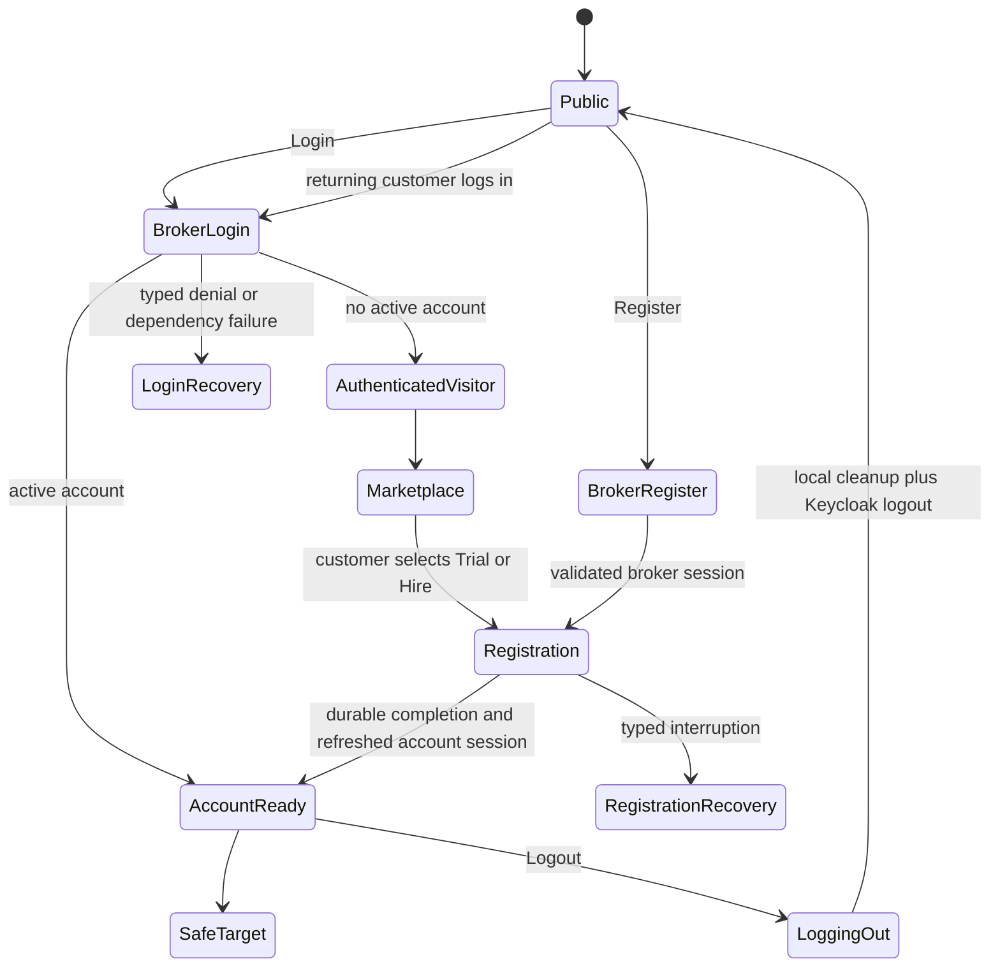
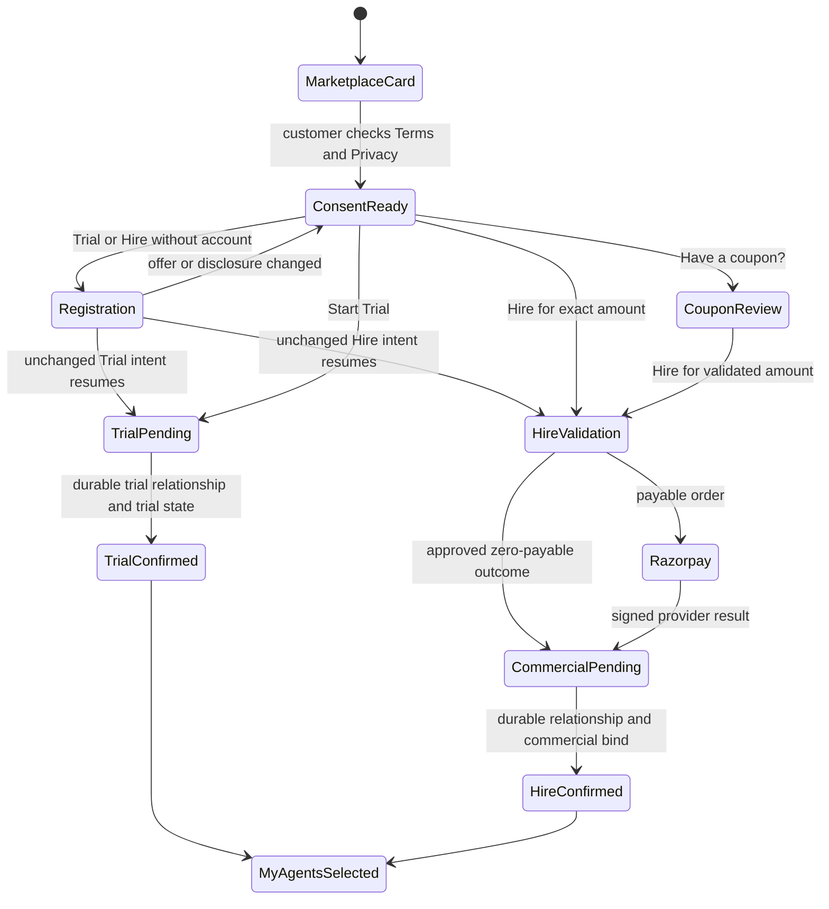

# Fundamental Customer Journeys Component Contract

**Work Component:** WC-107 - Fundamental Customer Journey Integrity  
**Owning office:** Chief Solution Architect (INST-005)  
**Implementing office:** Platform IT Expert (INST-010), after separate Founder authorization  
**Status:** DESIGN BASELINE - IMPLEMENTATION NOT AUTHORIZED  
**Deployable components:** Existing Web Application, Business Platform, Billing Engine, and Keycloak boundary only  
**Constitutional basis:** C-001, C-023, C-026, C-049, C-059, C-063, C-065, C-071, C-080; ADR-003, ADR-008, ADR-022

## 1. Purpose And Authority

Login, Registration, Logout, Trial, and Hire are one customer-journey boundary. A change is not
complete when an individual screen or endpoint passes while the end-to-end journey fails.

This contract composes:

- `architecture/reference/components/identity-boundary.md`;
- `architecture/reference/product/ae01-security-contract.md`;
- `architecture/reference/billing/customer-acquisition-spec.md`;
- `work-contracts/WC-097-marketplace-acquisition-experience.md`; and
- ADR-003, ADR-008, and ADR-022.

The identity, security, billing, and ADR contracts retain authority over identity proof, tenant
isolation, payment authorization, relationship admission, and Evidence First. For customer
presentation only, this later contract refines WC-097: the main card is the decision surface;
`/marketplace/{slug}` remains a direct-entry or expanded-disclosure route rendering the same concise
decision surface, not a mandatory second decision page. WC-097 ownership and safety rules remain.

## 2. Constitutional Mandates

| Mandate | Journey consequence |
|---|---|
| C-001 Human Override | Registration, Trial, and Hire begin only from an explicit customer command. Cancel and Emergency Stop remain available where applicable. |
| C-023 Evidence First | No account, Trial, Hire, payment, or relationship success is shown before its authoritative owner records the durable outcome. |
| C-026 Tenant Isolation | Identity and relationship resolution use server-derived tenant and actor bindings. Browser state never selects authority. |
| C-049 Honest Limitation | Price qualifications, trial limits, provider unavailability, unresolved payment, and recovery states are stated truthfully. |
| C-059 Traceability | Every implementation and test maps to a WC107 requirement identifier. |
| C-063 Data Minimisation | Tokens, customer identifiers, registration IDs, payment proof, coupon codes, and idempotency keys do not enter customer-visible URLs or logs. |
| C-065 Separation | Author review is mandatory; approval and merge remain Founder decisions. |
| C-071 Accessibility | Dialogs, consent, actions, progress, confirmation, focus, zoom, RTL, reduced motion, and recovery are keyboard and assistive-technology operable. |
| C-080 Test Isolation | All executable checks run in repository Docker test runners. |

## 3. Ownership Boundary

| Owner | Owns | Must not |
|---|---|---|
| Web Application | Journey composition, safe continuation, compact presentation, consent control, typed recovery, authoritative confirmation projection | Infer account, tenant, price, discount, payment, or relationship success |
| Keycloak boundary | Broker login, server session, refresh, RP-initiated logout, and explicit account selection after logout/switch | Create WAOOAW customer accounts or relationships |
| Business Platform Identity | Registration state, actor/login binding, account and membership resolution | Treat Login as Registration or infer identity from email |
| Business Platform Acquisition | Disclosure validation, idempotent Trial/Hire relationship admission, authoritative resume result | Create Hire before verified payment or claim success before durable relationship state |
| Billing Engine / Razorpay | Coupon validation, exact payable amount, order creation, signed payment outcome, commercial binding | Expose payment secrets or let the browser calculate discounts |
| My Agents projection | Authorized latest-first relationship list, selected relationship confirmation and next action | Highlight or confirm an inaccessible/browser-invented relationship |

## 4. Authentication Journey

### 4.1 Login

1. Login authenticates; it never creates an account, registration, tenant, membership, Trial, Hire,
   payment, or relationship.
2. An active account continues to a server-held named safe target whose authorization is rechecked.
   Arbitrary, external, encoded-origin, credential-bearing, stale, or inaccessible targets fall back
   to the configured default.
3. No active account establishes authenticated-visitor access and continues to Marketplace.
4. Only an explicit Register command or Trial/Hire command starts or resumes Registration.
5. A `403`, assurance denial, dependency error, or unavailable membership is not translated into
   Registration. The Web preserves the typed code and presents the approved recovery action.

### 4.2 Registration

1. Registration is actor-bound, idempotent, and minimal. Mobile remains optional for account
   completion and may be required later by a consequential action.
2. Register uses the normal default safe target. Trial/Hire registration retains a server-validated
   intent target and resumes that exact intent after account-session readiness.
3. Returning completed accounts do not enter a new registration. They continue to the safe target.
4. Completion is not successful until the account, tenant anchor, active membership, actor/login
   bindings, and fixed completion outcome are durable and the renewed account session resolves.

### 4.3 Logout And Return

1. Logout clears protected browser state, account/relationship caches, pending identity state, and
   server session, then performs Keycloak RP-initiated logout through an exact allowlisted redirect.
2. After logout, no background session restoration, silent OIDC authorization, authenticated browser
   history restoration, or cached protected rendering is permitted. The next explicit provider launch
   uses `prompt=select_account`.
3. Account switch performs the same cleanup before provider selection. A post-switch sentinel proves
   that no prior-account text, identifier, request, draft, storage, or cache entry remains.
4. Public locale and theme may remain; protected customer data may not.
5. A subsequent Login with the same proven identity resolves the same active account and membership.
   It does not return `403`, mint another account, or force Registration.
6. Selecting Register while already bound to a completed account continues safely; it does not show
   a fatal registration error.

### 4.4 Authentication Presentation

- Login and Registration use one stable route-backed dialog composition. Direct-entry Login,
  Register, and authentication-error routes render the same modal state machine.
- The WAOOAW logo is at the top-left, the page title begins at the top, and Close remains top-right.
- Close is keyboard and assistive-technology operable. Closing before explicit completion performs no
   account, relationship, payment, or authority mutation; only an approved non-secret draft may remain.
- Registration title size is `16px`; all remaining registration text is `12px`. Weight, color, and
  spacing provide hierarchy without increasing font size.
- `Profile details` and `Registration review` are not visible copy. Accessible progress names remain.
- No supported desktop or mobile viewport clips actions or creates root, dialog, or progress-rail
  horizontal overflow. The body scrolls only when content genuinely exceeds available height.

## 5. Trial And Hire Journey

### 5.1 Main Professional Card

The primary Marketplace card is the decision surface. It contains, without a separate verbose page:

- professional name and one customer-outcome statement;
- availability and three concise included-capability signals;
- prominent canonical monthly platform charge and cadence, with provider-cost qualification;
- trial duration and honest no-paid-action boundary;
- one Terms and Privacy consent checkbox; and
- `Start 14-day trial` and `Hire for <canonical monthly charge>` commands.

Detailed skills, limits, customer rights, refund/cancellation terms, and evidence remain available in
one compact progressive-disclosure panel. They do not push the primary commands around the screen.
The authenticated slug route renders this same surface for direct links and expanded disclosure; it
does not add a mandatory intermediate decision.

After consent, Trial and Hire each require one customer command. Registration may interrupt only when
the customer has no account; after completion the exact intent resumes without another consent or
duplicate command unless terms, price, or disclosure revision changed.
The customer may uncheck consent, close, or go back before the command without creating a Trial,
order, charge, relationship, or authority.

### 5.2 Trial

Trial never enters payment code. The command sends one server-held continuation with exact offer,
terms, disclosure, and idempotency state. A retry repeats Trial only. Success requires the durable
evaluation relationship, authoritative Trial state, and trial billing ledger. Trial limits and usage
remain metered. Trial provider unavailability is shown truthfully and never falls back to a paid
provider or creates a charge.

### 5.3 Hire And Coupon

Before Hire, the card and its compact disclosure show the selected versioned offer, exact INR amount,
included GST, cadence, provider-cost qualification, cancellation/refund terms, and any validated
coupon. With no coupon, selecting `Hire for <exact amount>` records the payment-authorization proposal,
causes the Billing Engine to rederive the canonical amount and create the order, and opens Razorpay
Standard Checkout directly. There is no mandatory intermediate review page.

Coupon validation must precede Razorpay order creation. The main card may expose a compact
`Have a coupon?` command that opens a WAOOAW pre-checkout field. The validated discount and final
amount update the command to `Hire for <discounted amount>`. Selecting that command opens Razorpay.
A coupon is not inserted into Razorpay Standard Checkout under the current contract. Provider-native
offers require a separately approved payment contract.

Coupon, idempotency, payment, registration, account, and relationship values remain in POST/server
state, never query parameters or browser history.

Hire success requires all of these outcomes:

1. Razorpay signed confirmation or an approved fully discounted outcome;
2. Billing Engine commercial evidence;
3. durable Business Platform Hire relationship;
4. commercial-outcome-to-relationship binding; and
5. an authorized My Agents projection containing that relationship.

An unresolved bind or callback remains pending/reconciling and cannot invite a new charge.

The funded Hire relationship does not itself authorize professional execution. Setup and goal
definition follow in My Agents. The later monthly operational contract, including version/hash,
scope, subscription terms, ad-spend treatment, and stop conditions, remains a separate customer
acceptance and activation authority under the AE-01 contract.

### 5.4 Confirmation And My Agents

Trial confirmation reads `Trial started` only from authoritative Trial state. Paid Hire confirmation
reads `Payment confirmed. Professional hired.`; approved zero-payable Hire reads
`Professional hired. No payment was due.` Both require every applicable Hire success condition above.

Both journeys continue to My Agents with the resulting authorized relationship selected. The Web
stores the relationship selection only in server-held flash state and gives the browser a short-lived,
random, one-use handle in a `Secure`, `HttpOnly`, `SameSite=Strict` cookie scoped to My Agents. The
server record is bound to the current actor and account and expires within five minutes. The cookie
contains no relationship, customer, account, payment, or outcome value. My Agents:

- keeps the customer-visible My Agents URL clean;
- orders relationships by authoritative update time;
- accepts a candidate selected relationship only when it exists in the authorized response;
- highlights and focuses that card without moving it outside authoritative ordering;
- derives the confirmation text from the selected card's Trial/Hire state, not a query-string claim;
- consumes and clears selection state after the authoritative projection; replay and expiry produce
   the ordinary unselected My Agents view;
- exposes the server-owned next action; and
- ignores or removes invalid, stale, or inaccessible selection values without existence disclosure.

## 6. Failure And Recovery Rules

| Condition | Required result |
|---|---|
| Login has no account | Authenticated Marketplace visitor; no Registration until explicit Register/Trial/Hire |
| Login or Registration gets typed `403` | Typed recovery; never generic `/403` and never automatic Registration |
| Logout followed by same-account Login | Same account/membership restored or a typed recoverable failure; never duplicate account |
| Logout or account switch | No silent restoration or prior-account state; next provider launch explicitly selects an account |
| Trial continuation fails | Retry Trial with the same semantic command; never call Hire or payment code |
| Trial provider unavailable or quota exhausted | Truthful typed state; no paid-provider fallback and no charge |
| Checkout cannot start | No relationship; show unavailable/retry only when the same command is safely retryable |
| Customer cancels or provider checkout is dismissed before a confirmed payment | No success or relationship; return to the unchanged authoritative offer and permit only a fresh explicit command |
| Payment outcome unknown | Reconcile the same payment; never start a second charge |
| Payment captured, relationship/bind pending | Show pending reconciliation; never show Hired |
| Relationship created but projection delayed | Read/retry authorized My Agents projection; never fabricate a card |
| Terms, price, or disclosure changed | Stop and require review plus fresh consent |

## 7. Observability And Privacy

Every cross-service journey emits one privacy-safe trace with service and revision identity, operation,
typed outcome, status class, correlation ID, and latency. It excludes tokens, email, customer/account,
registration, relationship, payment, coupon, idempotency, and provider-proof values.

Required spans cover Web, identity session/registration, acquisition continuation, Billing Engine,
Razorpay boundary, relationship creation/bind, and My Agents projection. Console logs alone do not
satisfy this requirement.

## 8. Completion Gate

The canonical requirement ledger is `work-contracts/WC-107-requirements.yaml`. WC-107 is complete
only when every requirement is `PASS` with its direct executable evidence, author review passes on
the exact final commit, and a separately authorized Demo deployment proves the complete Login,
Registration, Logout/returning Login, Trial, and Hire stories. Partial screen tests, passing counts,
or local substitutes do not qualify the Work Component.

## 9. Anti-Drift Rules

1. Tests assert customer stories and state transitions, not only component snapshots.
2. Any change to one journey state runs all WC107 browser stories and owner-contract tests.
3. No implementation may alter these state machines through UI fallback behavior.
4. Scope reduction or substituted evidence requires explicit Founder amendment of WC-107.
5. No screen may claim success from navigation, transport success, local state, or payment alone.
