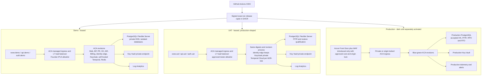

# GOAL-006 Azure Deployment Topology

## Purpose

This contract turns the accepted GOAL-006 constitutional, security, data, and platform decisions into one deployable Azure topology. Infrastructure and workflows MUST implement this contract before another full Demo apply.

## Constitutional Delivery Invariants

1. Build the exact-six application images once. Demo, UAT, Production, and rollback use the same immutable OCI digests.
2. The promoted release tuple is `manifest + six image digests + reviewed configuration digest + data schema compatibility + evidence`.
3. Images contain no environment configuration or secret values. Runtime configuration comes from reviewed environment configuration, managed identity, and Key Vault references.
4. Demo precedes UAT. UAT remains prohibited until explicit Founder Demo acceptance. Production customer traffic remains Founder-reserved.
5. Every environment has separate state, identity, VNet, data, Key Vault, DNS records, and evidence. Production data never moves down. "Dark Production" means the single Production environment before traffic activation, not a second environment.
6. A failed authorization, cost, security, recovery, or evidence gate stops before mutation.
7. First-party release membership remains exactly six. Pinned third-party runtime dependencies are recorded in a separately signed dependency manifest bound to the release tuple; they never become mutable or silently expand exact-six membership.

## Target Topology

Azure Container Apps ingress is the environment load balancer. Demo and UAT do not add Application Gateway or Front Door: those always-on products add cost without improving the Founder/tester-only boundary. Production edge is added only before customer traffic, after choosing an origin-lock design and accepting its cost.

## Environment Contract

| Capability | Demo | UAT | Dark Production |
|---|---|---|---|
| Public names | `www.demo.waooaw.com`, `api.demo.waooaw.com`, `auth.demo.waooaw.com` | `www.uat.waooaw.com`, `api.uat.waooaw.com`, `auth.uat.waooaw.com` | `www.waooaw.com`, `api.waooaw.com`, `auth.waooaw.com` reserved |
| Access | Founder `/32` | Approved tester CIDRs | No customer traffic |
| TLS | ACA managed certificates; monitored renewal | ACA managed certificates; monitored renewal | Front Door managed TLS after activation decision |
| Application compute | ACA min replicas `0`, max `1` | ACA min replicas `0`, bounded test max | Accepted production minima; no apply under WC-076 |
| Data | Synthetic; isolated PostgreSQL | Synthetic representative; isolated PostgreSQL and PITR test | Separate production data boundary |
| Redis | Transient ACA dependency; no backup | Transient ACA dependency; no backup | Managed or HA decision before activation |
| Temporal | Self-hosted ACA dependency using environment PostgreSQL | Temporal Cloud namespace and mTLS per ADR-015 | Temporal Cloud namespace; activation remains reserved |
| Expiry | Scale all workloads to zero; stop PostgreSQL; keep state, vault, DNS, backups and evidence | Same | Not leased |
| Cost | Pre-plan forecast gate, tags, alerts, short log retention | Same | Plan-only until separately authorized |

PostgreSQL Flexible Server cannot remain stopped indefinitely: Azure automatically restarts a stopped server after its service limit. A scheduled lease reconciler MUST re-stop expired Demo/UAT servers and verify workloads remain at zero. Reconciliation is idempotent, records evidence, retries only bounded transient failures, and escalates after its final attempt. Storage, backups, state, vault, DNS, and minimal telemetry continue to incur small foundation cost.

## Network And Trust Boundaries

- One VNet per environment with delegated ACA, delegated PostgreSQL, and private-endpoint subnets.
- Key Vault and PostgreSQL use private networking and private DNS.
- Only Web, Business Platform API, and a pinned identity-edge proxy receive public hostnames. Keycloak itself remains internal. The identity edge allowlists required OIDC discovery, realm, token, login, callback, and static-resource paths; it denies admin, management, metrics, and arbitrary proxying. CE, AIR, Billing, Redis, Temporal, database, direct Keycloak endpoints, and verification jobs remain private.
- ACA egress is default-deny with explicit HTTPS, Azure DNS, private network, GHCR, Azure control-plane, and approved provider destinations.
- Deployment and independent verification use distinct environment-scoped OIDC identities. Workloads use per-service managed identities and least-privilege Key Vault references.
- Terraform never registers subscription resource providers. Bootstrap owns the explicit provider allowlist.

## Data And Migration Contract

- Remove PostgreSQL sidecars from CE, BP, and Billing. One PostgreSQL Flexible Server per environment hosts separate databases/roles for application state, Keycloak, and Temporal.
- Terraform first creates PostgreSQL with Entra authentication enabled, password authentication disabled, and no administrator password. The environment deployment identity is the bounded Entra database administrator.
- A private, digest-pinned bootstrap job connects with an Entra token, creates separate databases and least-privilege roles, and writes generated dependency credentials directly to Key Vault. Values never pass through Terraform inputs, state, plans, outputs, workflow logs, or artifacts.
- Application services MUST use managed-identity token refresh where their runtime supports it. Password authentication is enabled only in a second reviewed foundation plan when a pinned dependency such as Keycloak or self-hosted Demo Temporal cannot use Entra tokens; only its generated non-admin role may use that path.
- UAT and Production use Temporal Cloud under ADR-015, with environment-specific mTLS material held in Key Vault. They do not deploy a self-hosted Temporal server.
- Redis remains reconstructible and transient in Demo/UAT.
- Migration is a digest-pinned, one-shot pre-traffic job. Migrations are expand-only and bind release/config/schema compatibility.
- A successful compute health check does not prove data recovery. UAT MUST prove isolated restore/PITR before Production readiness.
- Rollback never runs destructive down-migrations. The previous qualified digest must read the current additive schema.

## Implementation Interface Gates

| Gate | Required input | Output | Fail-closed behavior | Evidence owner |
|---|---|---|---|---|
| State isolation | Environment backend key, resource scope, OIDC subject, naming and tags | Separate environment plan/state with no cross-environment reference | Wrong subscription, scope, backend or existing-resource ownership stops plan | INST-009 with INST-007 |
| Release and dependencies | Signed exact-six manifest, signed pinned-dependency manifest, reviewed config digest, schema compatibility | One immutable deployment tuple | Missing member, digest/signature mismatch, mutable dependency or incompatible schema stops before cloud mutation | INST-009 with INST-006/007 |
| Runtime configuration | Versioned non-secret schema, Key Vault references, per-service identity matrix | Validated startup configuration with no image-baked environment values | Missing/unknown config, secret fallback or identity failure keeps revision unready | INST-005/007 with INST-009 |
| Database bootstrap | Entra-only server, database/role/RLS contract, bounded bootstrap identity | Separate databases/roles and Key Vault references; no value in Terraform or workflow evidence | Partial bootstrap, Key Vault write failure or unexpected password authority blocks application plan | INST-006/007 with INST-009 |
| Dependency handoff | Pinned identity-edge, Keycloak, Demo Temporal and Redis digests; Temporal Cloud endpoint/mTLS for UAT | Healthy private dependencies and approved public identity paths | Version, TLS, health or path-policy failure keeps application traffic at zero | INST-005/007 with INST-009 |
| Pre-traffic qualification | Migration result, readiness/dependency probes, required CCT set, public journey probes | Signed traffic-switch decision | Any required internal or public probe, CCT, migration or evidence failure leaves old revision active | INST-015 with INST-005/009 |
| Rollback | Previous qualified tuple, current schema compatibility, approval and hold state | Audited ACA traffic switch with no rebuild or migration | Missing tuple, expired hold, incompatible schema or approval failure blocks rollback | INST-009 with INST-006 |
| Lease expiry | Lease record, drain deadline, evidence watermark, protected-foundation inventory | Apps at zero, PostgreSQL stopped, evidence complete, foundation retained | Incomplete evidence, active work or protected-resource delta raises blocker; bounded retries never delete protected state | INST-009 with INST-006/015 |

The exact CCT subset, probe semantics, timeout bounds, configuration schema, role/RLS matrix, and dependency versions are executable inputs owned by the offices above. They must be versioned before the corresponding Terraform slice can apply.

## Promotion, Blue-Green, And Rollback

1. CI builds and attests the exact-six tuple once.
2. Plan verifies current-main release, configuration digest, cost, identity, state, provider allowlist, DNS prerequisites, and migration compatibility.
3. Apply creates a new ACA revision with a release-derived suffix while the previous revision remains available.
4. Run migration, private health probes, the environment-required CCT set, and public journey probes against the new revision without shifting production traffic. Failure of any required probe is blocking.
5. Shift traffic to the new revision only after all gates pass. Keep the immediately previous qualified revision at zero traffic for at least 24 hours and through the active Demo/UAT lease, whichever is later. Retain at most two inactive qualified revisions unless an incident or evidence hold requires more.
6. Rollback is a traffic switch to the immediately previous qualified revision plus its compatible configuration tuple. The previous digest MUST read the current additive schema; a release with a breaking schema cannot shift traffic until compatibility is restored and qualified. Rollback does not rebuild, retag, or run a destructive down-migration.
7. Failed new revisions receive zero traffic and are retained with evidence until the incident/release retention rule permits removal.

Demo may shift directly from zero to 100% after verification. UAT proves the same blue-green and rollback mechanics required for Production. Production rollout percentages and observation windows require accepted SLO evidence.

## Cost Controls

- Reuse the existing state account and GHCR release evidence.
- Use one small PostgreSQL Flexible Server per non-Production environment; stop it on lease expiry and reconcile the stopped state.
- Keep ACA workloads at min replicas zero outside active leases.
- Use short non-Production log retention and bounded ingestion.
- Do not provision Front Door Premium, Application Gateway, managed Redis, production HA, or a second region under the Demo recovery sprint.
- Every plan records current cost, forecast, incremental monthly estimate, lease expiry, and tagged resource delta. Forecast above the FA-052 INR 15,000 one-time or INR 10,000 monthly envelope blocks apply.

## Implementation Order

1. **Control plane:** explicit provider ownership, plan-only real OIDC gate, state and cost evidence.
2. **Foundation:** VNet/subnets, Log Analytics, Key Vault, PostgreSQL Flexible Server, private DNS, environment identities, DNS prerequisites.
3. **Runtime dependencies:** database roles/config references, Keycloak, Temporal, transient Redis; remove sidecar databases.
4. **Application plane:** exact-six ACA revisions, private/public boundaries, custom domains, managed TLS, managed identities.
5. **Release mechanics:** migration job, pre-traffic verification, blue-green traffic switch, rollback, lease expiry and scale-to-zero reconciliation.
6. **Promotion:** Founder Demo acceptance gate, same-tuple UAT deployment/qualification, dark-Production plan only.

A full Demo apply is prohibited until slices 1 through 5 pass a real OIDC plan and independent review. Documentation updates are limited to this contract, WC-076 execution references, and PROJECT_STATE checkpoints; executable code and cloud evidence remain primary.
