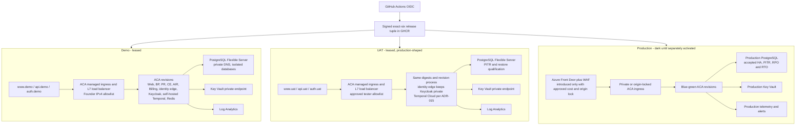

# GOAL-006 Azure Deployment Topology

## Purpose

This contract turns the accepted GOAL-006 constitutional, security, data, and platform decisions into one deployable Azure topology. Infrastructure and workflows MUST implement this contract before another full Demo apply.

## Constitutional Delivery Invariants

1. Build the exact-six application images once. Demo, UAT, Production, and rollback use the same immutable OCI digests.
2. The promoted release tuple is `manifest + six image digests + reviewed configuration digest + data schema compatibility + evidence`.
3. Images contain no environment configuration or secret values. Runtime configuration comes from reviewed environment configuration, managed identity, and Key Vault references.
4. Demo precedes UAT. UAT remains prohibited until explicit Founder Demo acceptance. Production customer traffic remains Founder-reserved.
5. Every environment has separate state, identity, VNet, data, Key Vault, DNS records, and evidence. Production data never moves down. "Dark Production" means the single Production environment before traffic activation, not a second environment.
6. A failed authorization, cost, security, recovery, or evidence gate stops before mutation.
7. First-party release membership remains exactly six. Pinned third-party runtime dependencies are recorded in a separately signed dependency manifest bound to the release tuple; they never become mutable or silently expand exact-six membership.

## Target Topology

Azure Container Apps ingress is the environment load balancer. Demo and UAT do not add Application Gateway or Front Door: those always-on products add cost without improving the Founder/tester-only boundary. Production edge is added only before customer traffic, after choosing an origin-lock design and accepting its cost.

## Environment Contract

| Capability | Demo | UAT | Dark Production |
|---|---|---|---|
| Public names | `www.demo.waooaw.com`, `api.demo.waooaw.com`, `auth.demo.waooaw.com` | `www.uat.waooaw.com`, `api.uat.waooaw.com`, `auth.uat.waooaw.com` | `www.waooaw.com`, `api.waooaw.com`, `auth.waooaw.com` reserved |
| Access | Founder `/32` | Approved tester CIDRs | No customer traffic |
| TLS | ACA managed certificates; monitored renewal | ACA managed certificates; monitored renewal | Front Door managed TLS after activation decision |
| Application compute | ACA min replicas `0`, max `1` | ACA min replicas `0`, bounded test max | Accepted production minima; no apply under WC-076 |
| Data | Synthetic; isolated PostgreSQL | Synthetic representative; isolated PostgreSQL and PITR test | Separate production data boundary |
| Redis | Transient ACA dependency; no backup | Transient ACA dependency; no backup | Managed or HA decision before activation |
| Temporal | Self-hosted ACA dependency using environment PostgreSQL | Temporal Cloud namespace and mTLS per ADR-015 | Temporal Cloud namespace; activation remains reserved |
| Expiry | Scale all workloads to zero; stop PostgreSQL; keep state, vault, DNS, backups and evidence | Same | Not leased |
| Cost | Pre-plan forecast gate, tags, alerts, short log retention | Same | Plan-only until separately authorized |

PostgreSQL Flexible Server cannot remain stopped indefinitely: Azure automatically restarts a stopped server after its service limit. A scheduled lease reconciler MUST re-stop expired Demo/UAT servers and verify workloads remain at zero. Reconciliation is idempotent, records evidence, retries only bounded transient failures, and escalates after its final attempt. Storage, backups, state, vault, DNS, and minimal telemetry continue to incur small foundation cost.

## Network And Trust Boundaries

- One VNet per environment with delegated ACA, delegated PostgreSQL, and private-endpoint subnets.
- Deployment jobs run on ephemeral Azure self-hosted runners inside environment-isolated runner subnets. GitHub-hosted runner public-IP discovery and temporary Storage firewall rules are prohibited after the Demo runner activation gate passes.
- Demo, UAT, and Production reuse one versioned runner blueprint, but never one runner instance or one unrestricted subnet. Each environment has a distinct runner label, subnet, managed identity boundary, and Storage private endpoint. Production runners remain at zero capacity unless a separately authorized Production job is active.
- The runner control plane is bootstrapped separately from environment Terraform because a runner must exist before Terraform can read its remote backend. Bootstrap state and credentials must not depend on the protected backend they create. GitHub App runner-registration material is held in Azure Key Vault, retrieved through managed identity, and never stored in GitHub variables or client secrets.
- Private endpoint addresses are environment-local private IPs, not public ingress addresses. One `privatelink.blob.core.windows.net` private DNS zone may be centrally managed and linked to the isolated runner VNets; VNet links do not grant cross-environment data or identity access.
- Terraform state and reviewed deployment configuration use Storage private endpoints. Public network access is disabled after private-path qualification. No load balancer, public IP, application DNS record, or TLS certificate is introduced by the Storage private endpoint path.
- Key Vault and PostgreSQL use private networking and private DNS.
- Only Web, Business Platform API, and a pinned identity-edge proxy receive public hostnames. Keycloak itself remains internal. The identity edge allowlists required OIDC discovery, realm, token, login, callback, and static-resource paths; it denies admin, management, metrics, and arbitrary proxying. CE, AIR, Billing, Redis, Temporal, database, direct Keycloak endpoints, and verification jobs remain private.
- ACA egress is default-deny with explicit HTTPS, Azure DNS, private network, GHCR, Azure control-plane, and approved provider destinations.
- Deployment and independent verification use distinct environment-scoped OIDC identities. Workloads use per-service managed identities and least-privilege Key Vault references.
- Terraform never registers subscription resource providers. Bootstrap owns the explicit provider allowlist.

### Private Runner Isolation Matrix

| Boundary | Demo | UAT | Production | Enforcement |
|---|---|---|---|---|
| Runner execution | ACA manual Job, zero idle executions | Not provisioned before Founder Demo acceptance | Zero capacity; plan-only until separate authorization | Distinct GitHub runner group and environment-specific label; one ephemeral registration per execution |
| Runner subnet ingress | Deny all | Deny all | Deny all | No public IP, load balancer, inbound endpoint or reusable runner listener |
| Runner subnet egress | HTTPS to GitHub Actions/GHCR and Azure identity/management; private endpoints for Storage and Key Vault; Azure DNS | Same after activation | Same after activation | NSG denies cross-environment address ranges and permits required HTTPS Internet egress; Storage and Key Vault public access remain disabled, so their data planes are private-only. No unsupported claim of NSG FQDN filtering is permitted. |
| Runner managed identity | Read runner-registration material from bootstrap Key Vault; no secret write; no environment deployment role | Separate identity and vault scope | Separate identity and vault scope | `Key Vault Secrets User` on the one environment runner secret set only |
| Deployment OIDC identity | Environment resource-group deployment roles and environment state container access; no GitHub App secret access | Separate environment scope | Separate environment scope | Azure RBAC and exact GitHub environment subject; runner identity and deployment identity are never interchangeable |
| Storage path | Demo private endpoint and Demo backend/config prefixes | UAT private endpoint and UAT prefixes | Production private endpoint and Production prefixes | Public network disabled after qualification; data-plane RBAC denies every cross-environment identity |
| Negative proof | Demo runner cannot read UAT/Production state or runner secrets | UAT runner cannot read Demo/Production state or runner secrets | Production runner cannot read Demo/UAT state or runner secrets | Activation blocks until independent RBAC and data-plane denial tests pass |

The central Platform Architect owns the `privatelink.blob.core.windows.net` zone and its audit log. Each VNet link requires the environment owner and Security Architect to approve the expected Storage account resource ID and endpoint IP in a versioned Deployment Stack parameter manifest. Reconciliation rejects a VNet link, endpoint resource ID, or endpoint IP absent from that manifest. A DNS answer is qualification evidence only: successful access still requires matching environment RBAC. Conflicting endpoint records, unexpected VNet links, or resolution to a public Storage address block activation.

Runner VNets are not peered to each other. NSGs explicitly deny the other environment address spaces before their final deny rule. Azure RBAC omits cross-environment grants; no shared runner role is assigned above an environment state account or Key Vault. Azure resource diagnostic logs, Network Watcher connection tests, DNS results, and denied data-plane requests form the negative evidence; DNS alone never proves isolation.

### Runner Bootstrap Playbook

1. A GitHub-hosted bootstrap job authenticates to Azure with the constrained bootstrap OIDC identity. It may call Azure management APIs and GitHub APIs, but it never reads Terraform state or deployment configuration.
2. The job reconciles a versioned Azure Deployment Stack containing the environment runner VNet/subnet, NSG, ACA environment and manual Job, runner managed identity, bootstrap Key Vault access, Storage private endpoint, private DNS link, budgets, and diagnostics. Azure Deployment Stacks are the bootstrap ownership/state record; no local Terraform state or circular dependency on the protected backend is permitted.
3. The stack deployment is idempotent and deny-delete protected for retained networking, identity, vault, DNS, and endpoint resources. An interrupted reconciliation is rerun against the same stack name and template digest. Unexpected ownership, drift, denied deletion, or partial provisioning stops before runner registration.
4. A deterministic pre-token workflow step reads `architecture/reference/pipeline/github-runner-app-manifest.json`, queries the live organization installation and compares every repository, permission and runner-group value. Any missing or additional live permission blocks token issuance; the step never mutates the App. INST-007 owns manifest changes and permission necessity; INST-009 owns schema validation and live equality. A new permission or replacement App requires an ADR amendment and fresh security acceptance.
5. The GitHub App RSA private key is imported as a non-exportable Key Vault key, not stored as a secret. The bootstrap OIDC identity receives `Key Vault Crypto User` on that exact key version and uses the Key Vault Cryptography client/REST `sign` operation with RS256, a 10-second timeout and at most three transient retries; private key bytes never enter workflow or runner memory and no fallback exists. The resulting App JWT (maximum ten-minute expiry) is exchanged at `POST /app/installations/{installation_id}/access_tokens`; that installation token calls `POST /orgs/dlai-sd/actions/runners/registration-token`. The bootstrap identity can create/update only the environment-specific short-lived runner-token secret and has no delete, list-all-secrets or environment deployment role. The ACA runner identity can `get` only that secret and has no key-sign permission. Token issuance occurs immediately before ACA start; the secret expires after 15 minutes and registration must finish within ten. The cleanup identity alone deletes the secret when registration succeeds, when the attempt fails/expires, and during orphan reconciliation.
6. The workflow has three jobs: `bootstrap-runner` on GitHub-hosted compute reconciles/validates the stack, obtains the token and starts ACA; `deploy-private` targets the environment runner label; `cleanup-runner` runs on GitHub-hosted compute with `if: always()` and depends on both preceding jobs. ACA concurrency is one and enforces a 60-minute execution timeout; GitHub ephemeral mode accepts one deployment job. Because hard workflow termination cannot guarantee downstream execution, the Deployment Stack also owns a separate ACA scheduled `runner-reconciler` Job every five minutes with a two-minute limit. Its distinct cleanup identity has exact-key signing, GitHub runner administration, token-secret delete and ACA execution read/stop; it has no token read/write, state/config data access or environment deployment role. It stops only executions older than 60 minutes or whose recorded GitHub run is terminal/absent, then removes that runner registration and token secret. Cleanup verifies zero registration/execution within five minutes and retries for at most 15 minutes. Any orphan beyond five minutes resets qualification, keeps the label inactive and notifies INST-009/007; no next deployment starts before cleanup.
7. Activation evidence proves private DNS resolution, exact configuration Blob access, Terraform backend list/read/write/lock behavior, no public Storage route, no cross-environment access, idempotent no-drift stack reconciliation, runner deregistration within the SLA, zero active runner executions, reconciler health/cost, and Deployment Stack health. Demo qualification includes ten successful executions plus five forced cancellations, including one hard workflow termination, with no orphan beyond five minutes. Only then may the Demo deployment workflow replace `ubuntu-latest` and remove temporary public-IP firewall mutation.
8. Bootstrap resources survive Demo/UAT lease expiry at zero runner executions. Recovery reconciles the same Deployment Stack. Key deletion, App revocation, unresolved drift, or failed orphan cleanup raises a blocker; it never falls back to a public endpoint or long-lived credential.

The non-exportable GitHub App key version expires no later than 90 days after import and rotates immediately after suspected disclosure. Azure Monitor alerts INST-007 and the Founder 14 days before expiry. Exactly two Key Vault key versions may overlap during a bounded validation window; the previous App key is revoked in GitHub and disabled in Key Vault after a successful registration test. Recovery requires Founder-controlled GitHub App key issuance/import plus Security Architect validation. Key Vault soft delete and purge protection are mandatory; no plaintext backup is retained. Expiry or rotation failure blocks bootstrap and never activates a fallback credential.

### Runner Activation Proof Matrix

| Activation stage | Required denial proof | Evidence | Gate consequence |
|---|---|---|---|
| Demo | Demo runner identity is denied access to reserved UAT/Production state scopes and runner-token scopes; no route exists to their address spaces | Azure RBAC assignment export, denied Storage/Key Vault requests where resources exist, no-peering inventory, NSG rules and Network Watcher connection result | Demo label remains inactive on any unexpected grant or route |
| UAT | Demo-to-UAT and UAT-to-Demo Storage/Key Vault requests are denied; neither VNet reaches the other endpoint; UAT is denied reserved Production scopes | Data-plane denial records, diagnostic logs, DNS results, no-peering inventory and Network Watcher connection results | UAT provisioning/label activation remains blocked |
| Production | Production-to-Demo/UAT and reciprocal Storage/Key Vault requests are denied; Production has no public Storage route | Same evidence set, independently run by INST-015 | Production remains plan-only until separate Founder activation |

INST-009 owns and executes the Runner Bootstrap interface gate after INST-003 accepts ADR-047 and INST-007 accepts the security design. INST-009 collects the immutable stack/template digest, exact GitHub App permission manifest, NSG/RBAC/DNS manifests and cost estimate. INST-015 independently executes the proof matrix, private-route tests, cancellation/orphan tests and zero-idle check. Results are recorded in the WC-076 checkpoint and PR evidence. Missing evidence keeps the environment runner label inactive with no public fallback.

The approved DNS parameter manifest is a preventive pre-start gate. The bootstrap job runs Deployment Stack `what-if` and compares live links/endpoints/records with the manifest. Wrong IDs/IPs, unexpected records/links or a public answer stop before token creation/ACA execution, retain live inventory and alert INST-007/009 for approved repair. Transient API timeout or expected-propagation NXDOMAIN retries at most three times with bounded backoff, then fails and alerts INST-009. Neither path creates a runner or silently changes DNS.

ADR-046 governs workload-to-service authentication and does not create a new runner certificate authority here. ADR-047 runner trust uses GitHub's ephemeral runner registration, Azure managed identity and environment-scoped OIDC. If a runner later calls a governed private WAOOAW service, that call must separately satisfy ADR-046; runner registration never substitutes for workload mTLS.

## Data And Migration Contract

- Remove PostgreSQL sidecars from CE, BP, and Billing. One PostgreSQL Flexible Server per environment hosts separate databases/roles for application state, Keycloak, and Temporal.
- Terraform first creates PostgreSQL with Entra authentication enabled, password authentication disabled, and no administrator password. The environment deployment identity is the bounded Entra database administrator.
- A private, digest-pinned bootstrap job connects with an Entra token, creates separate databases and least-privilege roles, and writes generated dependency credentials directly to Key Vault. Values never pass through Terraform inputs, state, plans, outputs, workflow logs, or artifacts.
- Application services MUST use managed-identity token refresh where their runtime supports it. Password authentication is enabled only in a second reviewed foundation plan when a pinned dependency such as Keycloak or self-hosted Demo Temporal cannot use Entra tokens; only its generated non-admin role may use that path.
- UAT and Production use Temporal Cloud under ADR-015, with environment-specific mTLS material held in Key Vault. They do not deploy a self-hosted Temporal server.
- Redis remains reconstructible and transient in Demo/UAT.
- Migration is a digest-pinned, one-shot pre-traffic job. Migrations are expand-only and bind release/config/schema compatibility.
- A successful compute health check does not prove data recovery. UAT MUST prove isolated restore/PITR before Production readiness.
- Rollback never runs destructive down-migrations. The previous qualified digest must read the current additive schema.

## Implementation Interface Gates

| Gate | Required input | Output | Fail-closed behavior | Evidence owner |
|---|---|---|---|---|
| Runner bootstrap | Accepted ADR-047, versioned Deployment Stack template, GitHub App permission manifest, environment label/group, subnet/NSG/RBAC/DNS matrix and cost estimate | One healthy ephemeral runner execution with private state/config access, negative isolation proof, deregistration and zero-idle evidence | Missing ADR acceptance, secret material, private resolution, exact backend operation, isolation denial, cleanup, stack health or cost proof blocks runner-label activation; no public fallback | INST-009 with INST-007; INST-015 independently verifies |
| State isolation | Environment backend key, resource scope, OIDC subject, naming and tags | Separate environment plan/state with no cross-environment reference | Wrong subscription, scope, backend or existing-resource ownership stops plan | INST-009 with INST-007 |
| Release and dependencies | Signed exact-six manifest, signed pinned-dependency manifest, reviewed config digest, schema compatibility | One immutable deployment tuple | Missing member, digest/signature mismatch, mutable dependency or incompatible schema stops before cloud mutation | INST-009 with INST-006/007 |
| Runtime configuration | Versioned non-secret schema, Key Vault references, per-service identity matrix | Validated startup configuration with no image-baked environment values | Missing/unknown config, secret fallback or identity failure keeps revision unready | INST-005/007 with INST-009 |
| Database bootstrap | Entra-only server, database/role/RLS contract, bounded bootstrap identity | Separate databases/roles and Key Vault references; no value in Terraform or workflow evidence | Partial bootstrap, Key Vault write failure or unexpected password authority blocks application plan | INST-006/007 with INST-009 |
| Dependency handoff | Pinned identity-edge, Keycloak, Demo Temporal and Redis digests; Temporal Cloud endpoint/mTLS for UAT | Healthy private dependencies and approved public identity paths | Version, TLS, health or path-policy failure keeps application traffic at zero | INST-005/007 with INST-009 |
| Pre-traffic qualification | Migration result, readiness/dependency probes, required CCT set, public journey probes | Signed traffic-switch decision | Any required internal or public probe, CCT, migration or evidence failure leaves old revision active | INST-015 with INST-005/009 |
| Rollback | Previous qualified tuple, current schema compatibility, approval and hold state | Audited ACA traffic switch with no rebuild or migration | Missing tuple, expired hold, incompatible schema or approval failure blocks rollback | INST-009 with INST-006 |
| Lease expiry | Lease record, drain deadline, evidence watermark, protected-foundation inventory | Apps at zero, PostgreSQL stopped, evidence complete, foundation retained | Incomplete evidence, active work or protected-resource delta raises blocker; bounded retries never delete protected state | INST-009 with INST-006/015 |

The exact CCT subset, probe semantics, timeout bounds, configuration schema, role/RLS matrix, and dependency versions are executable inputs owned by the offices above. They must be versioned before the corresponding Terraform slice can apply.

## Promotion, Blue-Green, And Rollback

1. CI builds and attests the exact-six tuple once.
2. Plan verifies current-main release, configuration digest, cost, identity, state, provider allowlist, DNS prerequisites, and migration compatibility.
3. Apply creates a new ACA revision with a release-derived suffix while the previous revision remains available.
4. Run migration, private health probes, the environment-required CCT set, and public journey probes against the new revision without shifting production traffic. Failure of any required probe is blocking.
5. Shift traffic to the new revision only after all gates pass. Keep the immediately previous qualified revision at zero traffic for at least 24 hours and through the active Demo/UAT lease, whichever is later. Retain at most two inactive qualified revisions unless an incident or evidence hold requires more.
6. Rollback is a traffic switch to the immediately previous qualified revision plus its compatible configuration tuple. The previous digest MUST read the current additive schema; a release with a breaking schema cannot shift traffic until compatibility is restored and qualified. Rollback does not rebuild, retag, or run a destructive down-migration.
7. Failed new revisions receive zero traffic and are retained with evidence until the incident/release retention rule permits removal.

Demo may shift directly from zero to 100% after verification. UAT proves the same blue-green and rollback mechanics required for Production. Production rollout percentages and observation windows require accepted SLO evidence.

## Cost Controls

- Reuse the existing state account and GHCR release evidence.
- Private runner networking is budgeted independently from application infrastructure: approximately one Private Link endpoint-hour charge per active environment plus low-volume data processing and one shared private DNS zone. VNet/subnet creation, private IP allocation, load balancers, and certificates add no runner-path charge because the design does not provision public ingress. The combined plan remains fail-closed above FA-052's INR 15,000 one-time or INR 10,000 monthly ceiling.
- Runner compute is ephemeral and starts at zero capacity. Demo is activated and cost-qualified first; UAT remains unprovisioned until Founder Demo acceptance; Production runner capacity remains zero and its private path is plan-only until separately authorized.
- The target state boundary is one Storage account per environment. During incremental migration, multiple environment-specific private endpoints may reach the existing account, but backend keys, identities, subnets, and evidence remain isolated; account separation must complete before UAT qualification.
- Use one small PostgreSQL Flexible Server per non-Production environment; stop it on lease expiry and reconcile the stopped state.
- Keep ACA workloads at min replicas zero outside active leases.
- Use short non-Production log retention and bounded ingestion.
- Do not provision Front Door Premium, Application Gateway, managed Redis, production HA, or a second region under the Demo recovery sprint.
- Every plan records current cost, forecast, incremental monthly estimate, lease expiry, and tagged resource delta. Forecast above the FA-052 INR 15,000 one-time or INR 10,000 monthly envelope blocks apply.

## Implementation Order

1. **Runner control plane:** bootstrap the Demo ephemeral self-hosted runner subnet, managed identity, Storage private endpoint and shared private DNS without depending on the protected remote backend; prove exact-blob and Terraform backend access, teardown, and cost evidence before changing workflow runner labels.
2. **Control plane:** after the complete qualification matrix passes, INST-009 records the result and the Founder authorizes Demo activation. One reviewed commit/PR must switch Demo plan jobs to the environment-scoped runner label and remove temporary public-IP firewall mutation, with an automated assertion that both deltas are present. Disable Storage public network access only after the private job proves exact backend operations. Repeat for UAT only after Founder Demo acceptance; keep Production plan-only and zero-capacity. Reintroducing public mutation or a GitHub-hosted deploy label requires a new reviewed architecture decision.
3. **Foundation:** VNet/subnets, Log Analytics, Key Vault, PostgreSQL Flexible Server, private DNS, environment identities, DNS prerequisites.
4. **Runtime dependencies:** database roles/config references, Keycloak, Temporal, transient Redis; remove sidecar databases.
5. **Application plane:** exact-six ACA revisions, private/public boundaries, custom domains, managed TLS, managed identities.
6. **Release mechanics:** migration job, pre-traffic verification, blue-green traffic switch, rollback, lease expiry and scale-to-zero reconciliation.
7. **Promotion:** Founder Demo acceptance gate, same-tuple UAT deployment/qualification, dark-Production plan only.

A full Demo apply is prohibited until slices 1 through 5 pass a real OIDC plan and independent review. Documentation updates are limited to this contract, WC-076 execution references, and PROJECT_STATE checkpoints; executable code and cloud evidence remain primary.
