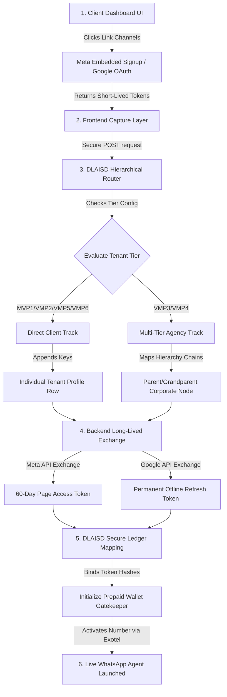
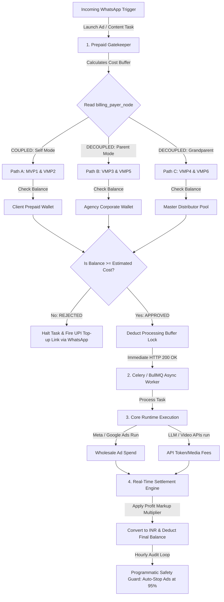

# DLAISD Enterprise Architecture: Automated AI Agent Clearinghouse

## Executive Summary
DLAI SATELLITE DATA (OPC) PRIVATE LIMITED operates a multi-tenant, omni-channel SaaS platform that enables small businesses (SMBs) and digital marketing agencies to manage their entire digital presence—creative theme ideation, asset production, automated publishing, ad deployment, and analytics monitoring—exclusively via a **conversational WhatsApp interface**. 

To drive growth, optimize financial metrics, and mitigate bad debt, the platform combines a **Model B (Embedded Signup) Meta integration** with a **Strictly Prepaid Clearinghouse Billing Model**. By routing all ad capital through our infrastructure, we inflate our top-line revenue, maximize corporate valuation, and gain enterprise leverage with major ad networks.

---

## 📱 Interface and Integration Philosophy

### 1. The WhatsApp Universal Dashboard
Non-technical small business owners face immense friction when navigating complex web-based ad managers, analytics dashboards, and OAuth connection screens. 

Our architecture replaces these UIs entirely with a responsive, natural language chat interface. 

Users coordinate advanced multi-platform strategies through standard WhatsApp interactions:

*   **Voice Notes / PTT Handling:** End-users interact using local voice recordings. The backend down-streams these `.ogg` binaries, transcribes them via localized speech-to-text models (optimized for code-switching syntax like Hinglish), and routes the structured text to the corresponding agent core.
*   **Interactive Control Loops:** Rather than relying on fragile keyword commands, the agent delivers contextual menus, media preview cards, and status trackers using native **WhatsApp Interactive Quick-Reply Buttons**.

### 2. Model B (Embedded Signup) Multi-Tenancy
Under Meta's Model B framework, our platform operates as a centralized **Business Solution Provider (BSP)** gateway. 

*   **Seamless Onboarding:** The customer initiates signup via a secure, white-labeled Meta Login SDK iframe inside our configuration dashboard. They log into Facebook once to authorize permissions (`whatsapp_business_management`, `whatsapp_business_messaging`) and map their phone lines.
*   **The Single Endpoint Webhook Router:** Meta streams all incoming messaging events across every client phone line into our single, centralized webhook URL. Our routing engine extracts the `WABA ID` (WhatsApp Business Account ID) or the receiving `phone_number_id` from the inbound JSON payload, instantly links it to the tenant row in our database, and triggers the isolated AI agent instance assigned to that specific account.

---

## 💰 The Prepaid Financial Clearinghouse Model

### 1. The Core Billing Pillars

*   **Strict Prepaid Enforcement (Our Insurance):** No ad asset is deployed, no LLM inference token is consumed, and no external media generation engine is triggered unless verified, cleared funds reside within the internal platform ledger. This insulates our entity from defaults, payment failures, and collection friction.
*   **Top-Line Revenue Influx (Our Valuation Engine):** By acting as the financial intermediary that collects gross media budgets before routing them to ad providers, our payment gateways report significantly higher gross transaction volumes. This scales top-line revenue, which serves as a massive valuation multiplier for institutional investors.
*   **Consolidated Purchasing Power (Our Network Leverage):** Aggregating hundreds of fragmented SMB budgets into our centralized corporate accounts changes our relationship with Meta and Google. We interface as a high-volume enterprise distributor, unlocking tier-one partner support channels, API beta access, and volume-based rebates.

### 2. Multi-Level Hierarchical Ledger (Self vs. Parent vs. Grandparent)
To serve individual merchants alongside multi-tiered marketing networks, the billing engine treats financial balances as an adjustable tree structure. Every tenant record contains an operational switch (`billing_payer_node`) pointing to whichever entity is responsible for clearing the invoice:

*   **Self-Billing Mode:** The individual client is an isolated silo. They fund their internal wallet directly via retail payment routes (UPI, NetBanking). The AI agent monitors this local wallet explicitly before initiating tasks.
*   **Parent-Billing Mode (Standard Agency):** An agency onboards their client onto the platform. The client has zero technical or financial connection to the system. The agency maintains a centralized prepaid balance. When the client's agent deploys an ad, the system debits the parent agency’s wallet ledger directly.
*   **Grandparent-Billing Mode (Enterprise Networks):** Designed for master agencies or white-label SaaS distributors who operate a network of sub-agencies. The top-tier corporate node funds a massive master pool, and the billing router tracks consumption through three levels of nested permissions, authorizing real-time child quotas while keeping all accounting clear and traceable.

---

## 📊 Solution Architecture Diagrams (Mermaid.js Code)

### 1. Custom Token Query & Onboarding System Diagram
*Paste this code block into [mermaid.live](https://mermaid.live) to render the full vector visual model.*

### 2. Multi-Tenant Billing Engine (Coupling / Decoupling) Diagram
*Paste this code block into [mermaid.live](https://mermaid.live) to view the dynamic multi-level funding pathways.*

---

## 🚀 The 6-Tier Hierarchical Matrix Breakdown

By implementing a centralized configuration switch (`ad_funding_source`), your backend runtime logic dynamically pivots to fulfill each roadmap deployment step:

### Track A: Direct Customers
*   **MVP1: DLAISD Budget ➔ Customer (No Personal Ad Account)**
    *   *Operational Setup:* Coupled Self-Billing. The non-technical customer pays DLAISD via UPI. Your platform runs their campaigns on our master corporate cards, using strict internal programmatic wallets to enforce budget safety caps.
*   **VMP2: DLAISD Budget ➔ Customer Owns Ad Account**
    *   *Operational Setup:* Read-Only Software Overlay. The client maintains their own credit profile natively with ad networks. DLAISD reads analytics streams to generate automated optimization markup invoices.

### Track B: Coupled Agency Funding
*   **VMP3: DLAISD Budget ➔ Agency Owns Ad Budget ➔ End-Customer has No Ad Account**
    *   *Operational Setup:* Decoupled Parent-Billing. The agency deposits lump-sum investments upfront into DLAISD's corporate account. Your code creates a child network wallet structure, letting the agency ration child quotas to their client book while our master card pipeline processes ad delivery.
*   **VMP4: DLAISD Budget ➔ Agency Owns Ad Budget ➔ End-Customer Has Their Own Ad Account**
    *   *Operational Setup:* Hybrid Corporate SaaS. The agency maps their corporate lines directly to the client accounts. Your core pipeline monitors the multi-tenant streams to audit and charge flat engine subscription fees.

### Track C: Decoupled Agency Pass-Through
*   **VMP5: DLAISD Budget ➔ Agency Does NOT Own Ad Budget ➔ End-Customer Has No Ad Account**
    *   *Operational Setup:* White-Labeled Retail Prepaid Collection. The agency governs content workflows, but the end-customer funds distribution. The platform generates direct programmatic digital links to collect money from the end-customer before authorizing AI publication modules.
*   **VMP6: DLAISD Budget ➔ Agency Does NOT Own Ad Budget ➔ End-Customer Has Their Own Ad Account**
    *   *Operational Setup:* Pure Multi-Seat Enterprise SaaS. Both parties possess mature digital setups. Your system charges fixed recurring structural platform fees per deployed conversational seat.

---

## 🚨 Critical Engineering & Compliance Considerations

### 1. Programmatic Budget Caps & Auto-Stops
To protect our corporate credit lines attached to master ad network manager accounts, the billing engine must execute hourly synchronization checks with Meta and Google ad delivery endpoints. If an ad network's reporting lag causes spend to approach a tenant’s prepaid limit, the platform triggers a programmatic pause campaign API request at **95% consumption**. This creates a safe financial buffer and prevents runaway spending.

### 2. Traceable & Explainable Audit Logs
Because agencies must justify expenditures to their end-clients, every single deduction from a wallet balance must generate an immutable, traceable transaction row. The ledger stores the raw API metrics (`input_tokens`, `output_tokens`, `media_bytes`, `ad_spend_usd`) alongside the localized customer transaction metrics. This allows our AI agent to immediately deliver clean, itemized invoice breakdowns textually whenever a user messages the inquiry string: *"Show balance sheet"* or *"Where did my budget go?"*